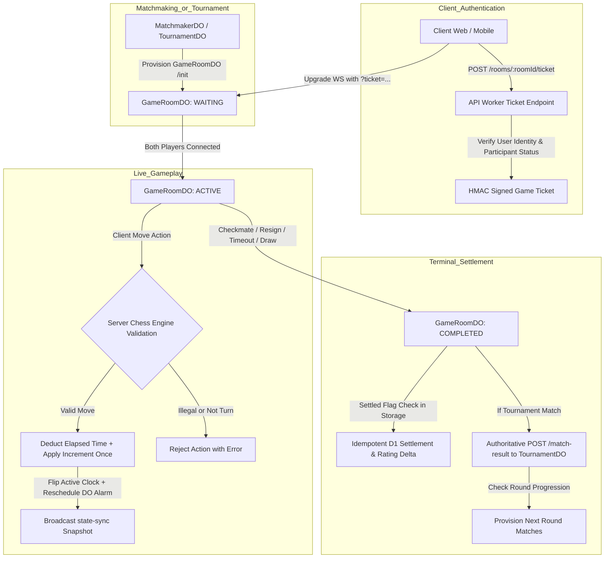

# ET-Chess Multiplayer Architecture & Game Lifecycle

## Overview

This document details the authoritative lifecycle of multiplayer games in ET-Chess, explaining every transition from initial matchmaking or tournament bracket generation to final rating settlement and bracket advancement.

---

## 1. End-to-End Game Lifecycle Flow

---

## 2. Handshake & Ticket Authentication

1. **Provisioning**: When matchmaking pairs two players or a tournament bracket generates a match, it invokes `POST /init` on the target `GameRoomDO` with `whiteUserId`, `blackUserId`, `timeControlMinutes`, and `timeControlIncrement`.
2. **Ticket Issuance**: When a client prepares to connect, it calls `POST /rooms/:roomId/ticket`.
   - The server verifies session identity via Better Auth `user.id`.
   - The server checks whether the user is White or Black (first checking `schema.rooms`, then querying `GameRoomDO.state`).
   - If authorized, an HMAC-SHA256 signed single-use ticket (`gameId:userId:displayName:expiry:nonce`) is returned.
3. **WebSocket Upgrade**:
   - The client upgrades to WebSocket at `/rooms/:roomId/websocket?ticket=<ticket>`.
   - `GameRoomDO` validates the cryptographic signature, matches `gameId`, and verifies single-use in Durable Object storage.
   - The connection is attached with `{ userId, displayName, color }` using the Cloudflare Hibernation API (`serializeAttachment`).

---

## 3. Server-Authoritative Clocks & Alarm Scheduling

1. **Display Only Clients**: Clients do not control remaining time. All clock math is executed server-side.
2. **Turn Transitions**:
   - When a legal move is submitted, elapsed time is deducted from the active player:
     $$\text{remaining} = \max(0, \text{currentRemaining} - \text{elapsed}) + \text{incrementMs}$$
   - The active clock flips to the opponent, and `turnStartedAt` is reset to `Date.now()`.
3. **Unified Single Alarm Slot**:
   - Cloudflare Durable Objects support exactly **one** scheduled alarm per instance.
   - `GameRoomDO` computes the unified earliest deadline:
     $$\text{alarmTime} = \min(\text{graceDeadline}, \text{clockDeadline})$$
   - When the alarm triggers, it re-evaluates actual elapsed time against remaining time before declaring timeout, preventing false timeouts from stale alarms.

---

## 4. Disconnect & Reconnect Grace Windows

- **Multi-Socket Filtering**: When a socket closes, `GameRoomDO` checks if the user has other active sockets open (e.g. multi-tab or mobile backgrounded).
- **Grace Period**: If zero active sockets remain, a 60-second grace window begins (`disconnectedPlayer = { userId, graceDeadline }`).
- **Resumption**: Reconnecting within 60 seconds cancels the grace period and broadcasts `opponent-reconnected`.
- **Forfeit**: If the grace period expires without reconnection, `alarm()` authoritatively declares a forfeit win for the opponent.

---

## 5. Tournament Integration & Advancement

- **Authoritative Forwarding**: Clients never submit tournament match results. When `GameRoomDO` enters terminal state (`COMPLETED`), it directly invokes `POST /match-result` on `TournamentDO`.
- **Draw Tiebreak**: In single-elimination tournament play, draws are deterministically resolved by higher seed advancing (`seed1 <= seed2`), preventing bracket deadlocks.
- **Automatic Provisioning**: Once all matches in a round finish, `TournamentDO` advances `currentRound`, pairs the winners, and provisions new `GameRoomDO` instances automatically.

---

## 6. Concurrency & Idempotency Guarantees

- **State Guards**: Once a game transitions to `COMPLETED` or `ABORTED`, subsequent moves, resignations, draw mutations, and clock alarms are strictly rejected or short-circuited.
- **Exactly-Once Settlement**: Both DO storage (`settled: true`) and database unique constraints on `game_settlements.game_id` prevent double Elo updates.
- **Storage Durability**: Game state, move history, clocks, and lifecycle status are committed to DO storage on every turn and terminal event, surviving worker restarts cleanly.
